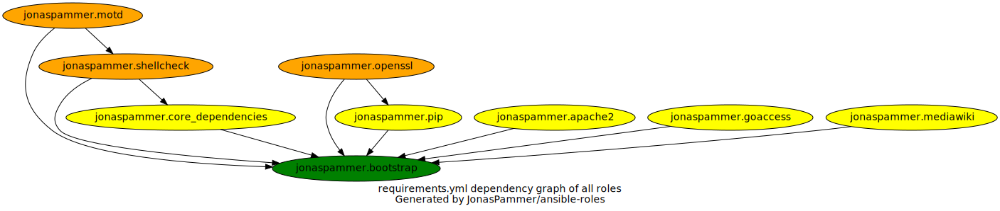

= JonasPammer's Ansible roles
Jonas Pammer <opensource@jonaspammer.at>;
GitHub Actions <>;
:source-highlighter: rouge

_https://jonaspammer.github.io/ansible-roles[This page]
is being periodically re-generated by a GitHub Action._

== Ansible Roles

|===
| Role name | Action Status | Version | Open Issues | Open Pull Requests

| ansible-role-bootstrap
| https://github.com/JonasPammer/ansible-role-bootstrap/actions/workflows/ci.yml[image:https://github.com/JonasPammer/ansible-role-bootstrap/actions/workflows/ci.yml/badge.svg[Testing CI]]
https://results.pre-commit.ci/latest/github/JonasPammer/ansible-role-bootstrap/master[image:https://results.pre-commit.ci/badge/github/JonasPammer/ansible-role-bootstrap/master.svg[pre-commit.ci status]]
| https://github.com/JonasPammer/ansible-role-bootstrap/releases[image:https://img.shields.io/github/commits-since/JonasPammer/ansible-role-bootstrap/latest.svg[version]]
| https://github.com/JonasPammer/ansible-role-bootstrap/issues[image:https://img.shields.io/github/issues-raw/JonasPammer/ansible-role-bootstrap[issues]]
| https://github.com/JonasPammer/ansible-role-bootstrap/pulls[image:https://img.shields.io/github/issues-pr/JonasPammer/ansible-role-bootstrap[pull requests]]

| ansible-role-core_dependencies
| https://github.com/JonasPammer/ansible-role-core_dependencies/actions/workflows/ci.yml[image:https://github.com/JonasPammer/ansible-role-core_dependencies/actions/workflows/ci.yml/badge.svg[Testing CI]]
https://results.pre-commit.ci/latest/github/JonasPammer/ansible-role-core_dependencies/master[image:https://results.pre-commit.ci/badge/github/JonasPammer/ansible-role-core_dependencies/master.svg[pre-commit.ci status]]
| https://github.com/JonasPammer/ansible-role-core_dependencies/releases[image:https://img.shields.io/github/commits-since/JonasPammer/ansible-role-core_dependencies/latest.svg[version]]
| https://github.com/JonasPammer/ansible-role-core_dependencies/issues[image:https://img.shields.io/github/issues-raw/JonasPammer/ansible-role-core_dependencies[issues]]
| https://github.com/JonasPammer/ansible-role-core_dependencies/pulls[image:https://img.shields.io/github/issues-pr/JonasPammer/ansible-role-core_dependencies[pull requests]]

| ansible-role-pip
| https://github.com/JonasPammer/ansible-role-pip/actions/workflows/ci.yml[image:https://github.com/JonasPammer/ansible-role-pip/actions/workflows/ci.yml/badge.svg[Testing CI]]
https://results.pre-commit.ci/latest/github/JonasPammer/ansible-role-pip/master[image:https://results.pre-commit.ci/badge/github/JonasPammer/ansible-role-pip/master.svg[pre-commit.ci status]]
| https://github.com/JonasPammer/ansible-role-pip/releases[image:https://img.shields.io/github/commits-since/JonasPammer/ansible-role-pip/latest.svg[version]]
| https://github.com/JonasPammer/ansible-role-pip/issues[image:https://img.shields.io/github/issues-raw/JonasPammer/ansible-role-pip[issues]]
| https://github.com/JonasPammer/ansible-role-pip/pulls[image:https://img.shields.io/github/issues-pr/JonasPammer/ansible-role-pip[pull requests]]

|===

=== Dependencies

Most roles have a “soft dependency” described in their `requirements.yml` file.
These soft dependencies are used in the relevant CI Tests to prepare the machine for the execution of a given role.
// or test interoperability.
You can choose to use those roles if you like them.
Here is an overview of these soft dependencies:

=== Distributions

A role may work on different *distributions*, like Red Hat Enterprise Linux (RHEL),
even though there is no test for this exact distribution.
https://github.com/JonasPammer/cookiecutter-ansible-role/blob/master/ansible-role-%7B%7B%20cookiecutter.role_name%20%7D%7D/.github/workflows/ci.yml[By default],
these Linux distributions are included in the tests:

|===
| OS Family | Distribution | Accompanying Docker Image

| Rocky
| Rocky Linux 8
| https://github.com/geerlingguy/docker-rockylinux8-ansible/actions?query=workflow%3ABuild[image:https://github.com/geerlingguy/docker-rockylinux8-ansible/workflows/Build/badge.svg?branch=master&event=push[CI]]

| RedHat
| CentOS 7
| https://github.com/geerlingguy/docker-centos7-ansible/actions?query=workflow%3ABuild[image:https://github.com/geerlingguy/docker-centos7-ansible/workflows/Build/badge.svg?branch=master&event=push[CI]]

| Debian
| Ubuntu 1804
| https://github.com/geerlingguy/docker-ubuntu1804-ansible/actions?query=workflow%3ABuild[image:https://github.com/geerlingguy/docker-ubuntu1804-ansible/workflows/Build/badge.svg?branch=master&event=push[CI]]

| Debian
| Ubuntu 2004
| https://github.com/geerlingguy/docker-ubuntu2004-ansible/actions?query=workflow%3ABuild[image:https://github.com/geerlingguy/docker-ubuntu2004-ansible/workflows/Build/badge.svg?branch=master&event=push[CI]]

| Debian
| Debian 10
| https://github.com/geerlingguy/docker-debian10-ansible/actions?query=workflow%3ABuild[image:https://github.com/geerlingguy/docker-debian10-ansible/workflows/Build/badge.svg?branch=master&event=push[CI]]

| Debian
| Debian 11
| https://github.com/geerlingguy/docker-debian11-ansible/actions?query=workflow%3ABuild[image:https://github.com/geerlingguy/docker-debian11-ansible/workflows/Build/badge.svg?branch=master&event=push[CI]]
|===

=== Ansible versions

https://github.com/JonasPammer/cookiecutter-ansible-role/blob/master/ansible-role-%7B%7B%20cookiecutter.role_name%20%7D%7D/tox.ini[By default],
these Ansible versions are included in the tests:

* 2.9
* 2.10
* 2.11
* 2.12

== all-repos

https://github.com/asottile/all-repos[all-repos] is a project by asotille
to clone multiple repositories and apply sweeping changes at once.

link:all-repos-in.json[] is an `all.repos.source.json_file` compatible file
consisting of all of my ansible roles.
It can be used in an all-repos configuration file as shown below:

.all-repos.json
[source%linenums,json,highlight=3..5]
----
{
    "output_dir": ".",
    "source": "all_repos.source.json_file",
    "source_settings": {
        "filename": "all-repos-in.json"
    },
    "push": "all_repos.push.github_pull_request",
    "push_settings": {
        "api_key": "...",
        "username": "..."
    }
}
----

=== Example Commands

----
$ python3 -m pip install all-repos

$ all-repos-clone

// TODO add all-repos-sed examples here
----