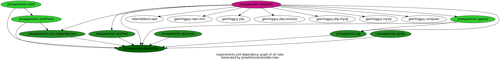

= JonasPammer's Ansible roles
Jonas Pammer <opensource@jonaspammer.at>;
GitHub Actions <>;
:toc:
:toclevels: 3
:toc-placement!:
:source-highlighter: rouge

ifdef::env-github[]
// https://gist.github.com/dcode/0cfbf2699a1fe9b46ff04c41721dda74#admonitions
:tip-caption: :bulb:
:note-caption: :information_source:
:important-caption: :heavy_exclamation_mark:
:caution-caption: :fire:
:warning-caption: :warning:
endif::[]

_https://jonaspammer.github.io/ansible-roles[This page]
is being periodically re-generated by a GitHub Action._

toc::[]

== Ansible Roles

|===
| Role name | Action Status | Version | Open Issues | Open Pull Requests

| 🍪 https://github.com/JonasPammer/cookiecutter-ansible-role[cookiecutter-ansible-role]
| https://github.com/JonasPammer/cookiecutter-ansible-role/actions/workflows/ci.yml[image:https://github.com/JonasPammer/cookiecutter-ansible-role/actions/workflows/ci.yml/badge.svg[Testing CI]]
https://results.pre-commit.ci/latest/github/JonasPammer/cookiecutter-ansible-role/master[image:https://results.pre-commit.ci/badge/github/JonasPammer/cookiecutter-ansible-role/master.svg[pre-commit.ci status]]
| https://github.com/JonasPammer/cookiecutter-ansible-role/releases[image:https://img.shields.io/github/commits-since/JonasPammer/cookiecutter-ansible-role/latest.svg[version]]
| https://github.com/JonasPammer/cookiecutter-ansible-role/issues[image:https://img.shields.io/github/issues-raw/JonasPammer/cookiecutter-ansible-role[issues]]
| https://github.com/JonasPammer/cookiecutter-ansible-role/pulls[image:https://img.shields.io/github/issues-pr/JonasPammer/cookiecutter-ansible-role[pull requests]]

| https://github.com/JonasPammer/ansible-role-bootstrap[bootstrap]
| https://github.com/JonasPammer/ansible-role-bootstrap/actions/workflows/ci.yml[image:https://github.com/JonasPammer/ansible-role-bootstrap/actions/workflows/ci.yml/badge.svg[Testing CI]]
https://results.pre-commit.ci/latest/github/JonasPammer/ansible-role-bootstrap/master[image:https://results.pre-commit.ci/badge/github/JonasPammer/ansible-role-bootstrap/master.svg[pre-commit.ci status]]
| https://github.com/JonasPammer/ansible-role-bootstrap/releases[image:https://img.shields.io/github/commits-since/JonasPammer/ansible-role-bootstrap/latest.svg[version]]
| https://github.com/JonasPammer/ansible-role-bootstrap/issues[image:https://img.shields.io/github/issues-raw/JonasPammer/ansible-role-bootstrap[issues]]
| https://github.com/JonasPammer/ansible-role-bootstrap/pulls[image:https://img.shields.io/github/issues-pr/JonasPammer/ansible-role-bootstrap[pull requests]]

| https://github.com/JonasPammer/ansible-role-core_dependencies[core_dependencies]
| https://github.com/JonasPammer/ansible-role-core_dependencies/actions/workflows/ci.yml[image:https://github.com/JonasPammer/ansible-role-core_dependencies/actions/workflows/ci.yml/badge.svg[Testing CI]]
https://results.pre-commit.ci/latest/github/JonasPammer/ansible-role-core_dependencies/master[image:https://results.pre-commit.ci/badge/github/JonasPammer/ansible-role-core_dependencies/master.svg[pre-commit.ci status]]
| https://github.com/JonasPammer/ansible-role-core_dependencies/releases[image:https://img.shields.io/github/commits-since/JonasPammer/ansible-role-core_dependencies/latest.svg[version]]
| https://github.com/JonasPammer/ansible-role-core_dependencies/issues[image:https://img.shields.io/github/issues-raw/JonasPammer/ansible-role-core_dependencies[issues]]
| https://github.com/JonasPammer/ansible-role-core_dependencies/pulls[image:https://img.shields.io/github/issues-pr/JonasPammer/ansible-role-core_dependencies[pull requests]]

| https://github.com/JonasPammer/ansible-role-motd[motd]
| https://github.com/JonasPammer/ansible-role-motd/actions/workflows/ci.yml[image:https://github.com/JonasPammer/ansible-role-motd/actions/workflows/ci.yml/badge.svg[Testing CI]]
https://results.pre-commit.ci/latest/github/JonasPammer/ansible-role-motd/master[image:https://results.pre-commit.ci/badge/github/JonasPammer/ansible-role-motd/master.svg[pre-commit.ci status]]
| https://github.com/JonasPammer/ansible-role-motd/releases[image:https://img.shields.io/github/commits-since/JonasPammer/ansible-role-motd/latest.svg[version]]
| https://github.com/JonasPammer/ansible-role-motd/issues[image:https://img.shields.io/github/issues-raw/JonasPammer/ansible-role-motd[issues]]
| https://github.com/JonasPammer/ansible-role-motd/pulls[image:https://img.shields.io/github/issues-pr/JonasPammer/ansible-role-motd[pull requests]]

| https://github.com/JonasPammer/ansible-role-openssh[openssh]
| https://github.com/JonasPammer/ansible-role-openssh/actions/workflows/ci.yml[image:https://github.com/JonasPammer/ansible-role-openssh/actions/workflows/ci.yml/badge.svg[Testing CI]]
https://results.pre-commit.ci/latest/github/JonasPammer/ansible-role-openssh/master[image:https://results.pre-commit.ci/badge/github/JonasPammer/ansible-role-openssh/master.svg[pre-commit.ci status]]
| https://github.com/JonasPammer/ansible-role-openssh/releases[image:https://img.shields.io/github/commits-since/JonasPammer/ansible-role-openssh/latest.svg[version]]
| https://github.com/JonasPammer/ansible-role-openssh/issues[image:https://img.shields.io/github/issues-raw/JonasPammer/ansible-role-openssh[issues]]
| https://github.com/JonasPammer/ansible-role-openssh/pulls[image:https://img.shields.io/github/issues-pr/JonasPammer/ansible-role-openssh[pull requests]]

| https://github.com/JonasPammer/ansible-role-pip[pip]
| https://github.com/JonasPammer/ansible-role-pip/actions/workflows/ci.yml[image:https://github.com/JonasPammer/ansible-role-pip/actions/workflows/ci.yml/badge.svg[Testing CI]]
https://results.pre-commit.ci/latest/github/JonasPammer/ansible-role-pip/master[image:https://results.pre-commit.ci/badge/github/JonasPammer/ansible-role-pip/master.svg[pre-commit.ci status]]
| https://github.com/JonasPammer/ansible-role-pip/releases[image:https://img.shields.io/github/commits-since/JonasPammer/ansible-role-pip/latest.svg[version]]
| https://github.com/JonasPammer/ansible-role-pip/issues[image:https://img.shields.io/github/issues-raw/JonasPammer/ansible-role-pip[issues]]
| https://github.com/JonasPammer/ansible-role-pip/pulls[image:https://img.shields.io/github/issues-pr/JonasPammer/ansible-role-pip[pull requests]]

| https://github.com/JonasPammer/ansible-role-shellcheck[shellcheck]
| https://github.com/JonasPammer/ansible-role-shellcheck/actions/workflows/ci.yml[image:https://github.com/JonasPammer/ansible-role-shellcheck/actions/workflows/ci.yml/badge.svg[Testing CI]]
https://results.pre-commit.ci/latest/github/JonasPammer/ansible-role-shellcheck/master[image:https://results.pre-commit.ci/badge/github/JonasPammer/ansible-role-shellcheck/master.svg[pre-commit.ci status]]
| https://github.com/JonasPammer/ansible-role-shellcheck/releases[image:https://img.shields.io/github/commits-since/JonasPammer/ansible-role-shellcheck/latest.svg[version]]
| https://github.com/JonasPammer/ansible-role-shellcheck/issues[image:https://img.shields.io/github/issues-raw/JonasPammer/ansible-role-shellcheck[issues]]
| https://github.com/JonasPammer/ansible-role-shellcheck/pulls[image:https://img.shields.io/github/issues-pr/JonasPammer/ansible-role-shellcheck[pull requests]]

| https://github.com/JonasPammer/ansible-role-checkmk_server[checkmk_server]
| https://github.com/JonasPammer/ansible-role-checkmk_server/actions/workflows/ci.yml[image:https://github.com/JonasPammer/ansible-role-checkmk_server/actions/workflows/ci.yml/badge.svg[Testing CI]]
https://results.pre-commit.ci/latest/github/JonasPammer/ansible-role-checkmk_server/master[image:https://results.pre-commit.ci/badge/github/JonasPammer/ansible-role-checkmk_server/master.svg[pre-commit.ci status]]
| https://github.com/JonasPammer/ansible-role-checkmk_server/releases[image:https://img.shields.io/github/commits-since/JonasPammer/ansible-role-checkmk_server/latest.svg[version]]
| https://github.com/JonasPammer/ansible-role-checkmk_server/issues[image:https://img.shields.io/github/issues-raw/JonasPammer/ansible-role-checkmk_server[issues]]
| https://github.com/JonasPammer/ansible-role-checkmk_server/pulls[image:https://img.shields.io/github/issues-pr/JonasPammer/ansible-role-checkmk_server[pull requests]]

|===

=== Dependencies

==== Soft Dependencies
Most roles have a set of “soft dependencies” described in their `requirements.yml` file.
These soft dependencies are used in the relevant CI Tests
to prepare the machine for the execution of a given role
or to test some kind of interoperability.

You can choose to use those roles if you like them.

Here is an overview of all roles with their soft dependencies:

The dependencies are soft for these reasons:

* Better re-usability.
* Easier to fork.
* *Lets the system developer assume a start-state of a machine.*

Because these dependencies are loose,
you have to include them in your playbook yourself
(assuming you want to use them):

[source,yaml]
----
- name: make the best machine ever
  hosts: all
  become: yes

  roles:
    - role: jonaspammer.bootstrap
    - role: jonaspammer.java
----

==== Hard Dependencies

Some roles have a required hard dependency on another role,
mainly for a common handler or for variables that are set in the parent role and used in the child role.
_These role dependencies
(https://docs.ansible.com/ansible/latest/user_guide/playbooks_reuse_roles.html#using-role-dependencies[official documentation])
are described in `meta/main.yml` file of a given role under `dependencies`._

|===
| Role name | Depends on | Reason

|===

Here is an overview of all hard dependencies:

image:./graphs/dependencies_ALL-hard.svg[meta/main.yml hard-dependency graph of all roles]

Because Ansible defines role dependencies as 'prerequisites' and not 'true dependencies',
you still *have to* include them in your playbook yourself:

[source,yaml]
----
- name: Converge
  hosts: all
  become: yes

  roles:
    # (preperation roles have been left out for this example)

    - role: jonaspammer.httpd
    - role: jonaspammer.php
----

=== Tested Distributions

A role may work on different *distributions*, like Red Hat Enterprise Linux (RHEL),
even though there is no test for this exact distribution.

The following Linux distributions are included in the tests of most roles
https://github.com/JonasPammer/cookiecutter-ansible-role/blob/master/ansible-role-%7B%7B%20cookiecutter.role_name%20%7D%7D/.github/workflows/ci.yml[by default]:

|===
| OS Family | Distribution | Distribution Release Date | Distribution End of Life | Accompanying Docker Image

| RedHat
| CentOS 7
| 2014-07
| 2024-06
| https://github.com/geerlingguy/docker-centos7-ansible/actions?query=workflow%3ABuild[image:https://github.com/geerlingguy/docker-centos7-ansible/workflows/Build/badge.svg?branch=master&event=push[CI]]

| Rocky
| Rocky Linux 8 (https://pythonspeed.com/articles/centos-8-is-dead/[CentOS 8 is dead.])
| 2021-06
| 2029-05
| https://github.com/geerlingguy/docker-rockylinux8-ansible/actions?query=workflow%3ABuild[image:https://github.com/geerlingguy/docker-rockylinux8-ansible/workflows/Build/badge.svg?branch=master&event=push[CI]]

| RedHat
| Fedora 35
| 2021-11
| 2022-11
| https://github.com/geerlingguy/docker-fedora35-ansible/actions?query=workflow%3ABuild[image:https://github.com/geerlingguy/docker-fedora35-ansible/workflows/Build/badge.svg?branch=master&event=push[CI]]

| Debian
| Ubuntu 1604
| 2016-04
| 2026-04
| https://github.com/geerlingguy/docker-ubuntu1604-ansible/actions?query=workflow%3ABuild[image:https://github.com/geerlingguy/docker-ubuntu1604-ansible/workflows/Build/badge.svg?branch=master&event=push[CI]]

| Debian
| Ubuntu 1804
| 2018-04
| 2028-04
| https://github.com/geerlingguy/docker-ubuntu1804-ansible/actions?query=workflow%3ABuild[image:https://github.com/geerlingguy/docker-ubuntu1804-ansible/workflows/Build/badge.svg?branch=master&event=push[CI]]

| Debian
| Ubuntu 2004
| 2021-09
| 2030-04
| https://github.com/geerlingguy/docker-ubuntu2004-ansible/actions?query=workflow%3ABuild[image:https://github.com/geerlingguy/docker-ubuntu2004-ansible/workflows/Build/badge.svg?branch=master&event=push[CI]]

| Debian
| Debian 10
| 2019-07
| 2022-08
| https://github.com/geerlingguy/docker-debian10-ansible/actions?query=workflow%3ABuild[image:https://github.com/geerlingguy/docker-debian10-ansible/workflows/Build/badge.svg?branch=master&event=push[CI]]

| Debian
| Debian 11
| 2021-08
| ?
| https://github.com/geerlingguy/docker-debian11-ansible/actions?query=workflow%3ABuild[image:https://github.com/geerlingguy/docker-debian11-ansible/workflows/Build/badge.svg?branch=master&event=push[CI]]
|===

=== Tested Ansible versions

The following Ansible versions are tested in the tests of each distribution
https://github.com/JonasPammer/cookiecutter-ansible-role/blob/master/ansible-role-%7B%7B%20cookiecutter.role_name%20%7D%7D/tox.ini[by default]:

* 2.9
* 2.10
* 2.11
* 2.12